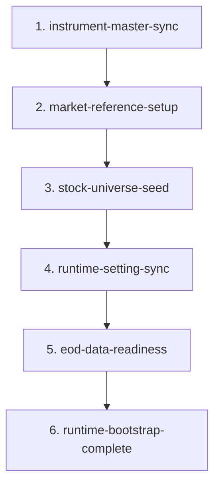

# Market Scanner Workflow Tracker

This document is the project source of truth.

Every stage must be understood, implemented, tested, and verified against the intended business behavior before it is marked complete.

### Status Legend
- `[IMPLEMENTED + TESTED]`: Complete, verified in code, database, and test suite.
- `[IMPLEMENTED - NEEDS REVIEW]`: Implemented, but requires verification, edge-case review, or refactoring.
- `[PARTIAL]`: Partially implemented; missing core components, tests, or workflow hooks.
- `[TODO]`: Planned task, not yet started.
- `[BLOCKED]`: Blocked on prerequisite design or external factors.

---

## 1. Verified Application Startup `[IMPLEMENTED + TESTED]`

Verified in production:
- PostgreSQL connection succeeds.
- Flyway migrations succeed (`V001` through `V033`).
- Spring repositories and services initialize.
- Application starts successfully.
- Angel One API connection succeeds.
- Initial instrument catalog synchronization succeeds.

> [!NOTE]
> Production profile activation still needs verification because logs previously showed the default profile.

---

## 2. Instrument Master Sync `[IMPLEMENTED + TESTED]`

Startup workflow:
```text
instrument-master-sync
```

**Behavior:**
- Checks `workflow_status` table.
- Creates the workflow row with `READY` if missing.
- Skips only when the active workflow status is `SUCCESS`.
- Retries failed or incomplete startup attempts.
- Downloads the Angel One instrument catalog.
- Stores valid NSE instruments in `instrument_master`.
- Validates the catalog contains `NIFTY/NSE`.
- Marks the workflow `SUCCESS` after completion.
- Marks the workflow `FAILED` on error and stops startup.

**Verified result:**
- Catalog records were imported successfully.
- `instrument_master` contains the catalog data.
- `NIFTY/NSE` exists.

**Table:**
- `instrument_master`

---

## 3. Workflow Status `[IMPLEMENTED + TESTED]`

**Current states:**
- `READY`, `RUNNING`, `SUCCESS`, `FAILED`, `SKIPPED`

**Implemented behavior:**
- Startup instrument sync uses `workflow_status`.
- Active duplicate workflow records are detected in code.
- Workflow dependencies are supported by `depends_on_workflow_id`.
- `process_date` column supported:
  - `NULL` for one-time startup workflows.
  - Specific trading date (`YYYY-MM-DD`) for daily market/pre-market workflows.
- Repository and service methods support querying and creating startup (`process_date IS NULL`) and daily workflows (`process_date = ?`).
- Comprehensive unit tests verified in `WorkflowStatusServiceTest`.

**Required Startup Workflow Sequence:**


Each workflow must be created as `READY`, transitioned to `RUNNING`, and marked `SUCCESS` or `FAILED`.

---

## 4. Market Reference Setup `[IMPLEMENTED + TESTED]`

**Purpose:**
- Ensure `NIFTY/NSE` exists in `instrument_master`.
- Ensure it is active (`is_active = true`).
- Ensure it is classified as an `INDEX` (both `instrument_type` and `segment`).
- Preserve catalog metadata when available.

**Dependency:** `instrument-master-sync`

**Workflow entry:** `market-reference-setup`

**Table:**
- `instrument_master`

---

## 5. Stock Universe `[IMPLEMENTED + TESTED]`

**Current behavior:**
- Reads selected symbols from `bootstrap/simulation-universe-nse.csv`.
- Uses only the CSV `symbol` column.
- Resolves each symbol from `instrument_master` as the single source of truth.
- Rejects missing, inactive, or non-equity instruments.
- Takes company name from `instrument_master`.
- Inserts selected symbols into `stock_universe`.
- Sets `is_tradable = false`.
- Runs only when `stock_universe` is empty.
- Integrated into the fail-closed startup workflow sequence.

**Tables & Columns:**
- `stock_universe`:
  - `is_active`: symbol belongs to the application universe.
  - `is_tradable`: symbol is approved for trading; initially `false`.
- `instrument_master`

**Dependency:** `market-reference-setup`

**Workflow entry:** `stock-universe-seed`

---

## 6. Runtime Setting Sync `[IMPLEMENTED + TESTED]`

**Purpose:**
- Maintain human-readable, database-backed operational configuration and schedule tunables.
- Allow querying and updating operational parameters directly in the database without code redeployment.
- Verifies and heals missing runtime settings from default properties on startup.

**Table Structure (`runtime_setting`):**
- `id`: Primary key (`INTEGER GENERATED BY DEFAULT AS IDENTITY`)
- `name`: Human-readable identifier (`TEXT NOT NULL UNIQUE`, e.g. `websocket.connect.time`)
- `value`: Setting value (`TEXT NOT NULL`, e.g. `09:15`)
- `value_type`: Data type indicator (`TEXT NOT NULL`, e.g. `TIME`, `INTEGER`, `BOOLEAN`, `DOUBLE`, `STRING`)
- `description`: Plain-English explanation of the parameter (`TEXT`)
- `is_active`: Active flag (`BOOLEAN NOT NULL DEFAULT TRUE`)
- `updated_at`: Timestamp of last update (`TEXT NOT NULL`)

**Dependency:** `stock-universe-seed`

**Workflow entry:** `runtime-setting-sync`

**Managed Settings:**
- Operational schedule times (`angelone.login.time`, `websocket.connect.time`, `websocket.disconnect.time`, `angelone.disconnect.time`, `housekeeping.time`).
- Feed & WebSocket rules (`websocket.subscribe.mode`, `websocket.idle.close.minutes`, `websocket.close.recheck.minutes`).
- Data retention windows (`retention.candles.days`, `retention.live.signals.days`).
- Feed health & alerts (`alert.stale.ticks.minutes`, `alert.parser.failures.threshold`).

---

## 7. EOD Data Readiness `[IMPLEMENTED + TESTED]`

Before runtime bootstrap is marked complete, the application determines the required trading date and verifies EOD readiness.

**First-Time Startup Behavior:**
- Since historical bootstrap is removed, on a fresh startup with an empty database, this step seeds initial baseline `EodDataEntry` records (`status = COMPLETE`, minute counts = 375, source = `INITIAL_BASELINE`) for the 50 active stocks and `NIFTY` for the previous completed trading day.
- Establishes the initial anchor so pre-market indicators and volume baselines can operate.

**Daily Pre-Market Behavior:**
- Verifies that verified EOD entries exist for all active stocks and `NIFTY` from the previous completed trading day.
- Fails closed if any active equity has missing, `PARTIAL`, or `FAILED` data.

**Dependency:** `runtime-setting-sync`

**Workflow entry:** `eod-data-readiness`

**Table:**
- `eod_data_entry`

---

## 8. Runtime Bootstrap Completion `[IMPLEMENTED + TESTED]`

Runtime bootstrap is executed by `RuntimeBootstrapService` in 6 sequential, fail-closed stages:
1. `instrument-master-sync` is `SUCCESS`.
2. `market-reference-setup` is `SUCCESS`.
3. `stock-universe-seed` is `SUCCESS`.
4. `runtime-setting-sync` is `SUCCESS`.
5. `eod-data-readiness` is `SUCCESS`.
6. `runtime-bootstrap-complete` is `SUCCESS` after validating non-blank broker tokens for all active stocks & `NIFTY`.

**Workflow entry:** `runtime-bootstrap-complete`

**Post-bootstrap flow:**
```text
Application Readiness ──> Pre-Market Workflow ──> Live Runtime Prep ──> WebSocket Connection ──> Universe Subscription
```

---

## 9. Historical Bootstrap `[REMOVED & DELETED]`

**Status:**
- `HistoricalBootstrapService` and `HistoricalBootstrapServiceTest` have been completely deleted from the codebase.
- Removed historical bootstrap calls from `RuntimeBootstrapService`.
- Removed scheduled historical bootstrap from `MarketScheduler` and `ScheduledJobAlertService`.
- Removed historical bootstrap gating from `PreMarketWorkflowService`.
- All candle repair and gap filling is now exclusively handled by `backfill_job` and `IntradayCandleBackfillService`.

---

## 10. Active-Universe Instrument Sync `[REMOVED & DELETED]`

**Status:**
- `syncActiveUniverse()` has been completely deleted from `InstrumentMasterSyncService`, `RuntimeBootstrapService`, and `PreMarketWorkflowService`.
- Enforced unidirectional data flow:
```text
Angel One Catalog ──> instrument_master ──> stock_universe
```

---

## 11. Broker Mapping Validation `[REFACTORED]`

**Status:**
- Legacy `validateRequiredMappings()` has been completely deleted.
- Validation at startup is inherently guaranteed by `StockUniverseSeeder` (which resolves each symbol against active equities in `instrument_master`).
- Pure read-only token readiness check in stage 6 confirms valid tokens exist for active stocks and `NIFTY`.

---

## 12. Pre-Market Workflow `[PARTIAL - REDESIGN REQUIRED]`

**New intended order:**
1. Refresh instrument catalog if required.
2. Ensure market references.
3. Validate active broker mappings.
4. Check required EOD readiness.
5. Calculate market and volume context.
6. Start live runtime when session conditions are met.

**Pre-market must NOT:**
- Seed the initial CSV universe.
- Run historical bootstrap.
- Continue when required data or broker mappings are missing.

---

## 13. Live Market Data `[IMPLEMENTED - NEEDS REVIEW]`

**Responsibilities:**
- Connect to Angel One WebSocket.
- Subscribe to active universe and `NIFTY`.
- Parse incoming ticks.
- Build live 1-minute candles.
- Track feed health.
- Detect live gaps and queue for repair.
- Flush open candles before disconnect.

**Precondition:** `runtime-bootstrap-complete` = `SUCCESS`

**Tables:**
- `live_feed_state`, `live_minute_resolution`, `market_minute_snapshot`, `market_candles`

---

## 14. Remaining Tables and Later Work

- **Daily data quality `[TODO / FUTURE]`**: `daily_data_status`, `daily_candle_summary`
- **Backfill and gap repair `[IMPLEMENTED - NEEDS REVIEW]`**: `backfill_job` (verify PostgreSQL concurrency and lease expiration).
- **Scanner execution `[IMPLEMENTED - NEEDS REVIEW]`**: `scan_execution_state`, `scanner_runs`, `scan_results` (confirm `stock_prices` vs `market_candles` usage).
- **Signal outcomes `[IMPLEMENTED - NEEDS REVIEW]`**: `signal_outcomes` (entry, exit, horizon, MFE/MAE definitions).
- **Runtime recovery and alerts `[IMPLEMENTED - NEEDS REVIEW]`**: `StartupRecoveryService`, `RuntimeHousekeepingService`, `RuntimeAlertService`.

---

## 15. Summary of Implementation Status & Next Roadmap

### Current Status Overview

| Component / Area | Status | Key Notes |
|---|---|---|
| **Application Startup & DB** | `[IMPLEMENTED + TESTED]` | PostgreSQL, Flyway migrations (`V001`-`V033`), Spring beans, Angel One API connection. |
| **Instrument Master Sync** | `[IMPLEMENTED + TESTED]` | Downloads Angel One catalog, populates `instrument_master`, tracked in `workflow_status`. |
| **Market Reference Setup** | `[IMPLEMENTED + TESTED]` | `NIFTY/NSE` index configured, active, and verified in `workflow_status`. |
| **Stock Universe Seeding** | `[IMPLEMENTED + TESTED]` | Seeds 50 stocks from CSV using `instrument_master` as source of truth; tracked in `workflow_status`. |
| **Runtime Setting Sync** | `[IMPLEMENTED + TESTED]` | Clean `runtime_setting` schema (`id`, `name`, `value`, `value_type`, `description`, `is_active`, `updated_at`) and automatic verification. |
| **EOD Data Readiness** | `[IMPLEMENTED + TESTED]` | Seeds initial baseline EOD records on fresh start; verifies prior trading day on daily runs. |
| **Runtime Bootstrap Gate** | `[IMPLEMENTED + TESTED]` | Full 6-stage fail-closed startup pipeline orchestrated in `RuntimeBootstrapService`. |
| **Workflow Status Schema** | `[IMPLEMENTED + TESTED]` | `workflow_status` with `process_date` column, entity, repository, and service methods tested. |
| **Runtime Readiness Service** | `[IMPLEMENTED + TESTED]` | Evaluates startup readiness directly from `workflow_status` (`RUNTIME_BOOTSTRAP_COMPLETE`). |
| **Pre-Market Redesign** | `[PARTIAL]` | Redesign to use dated `workflow_status` records (`process_date = YYYY-MM-DD`). |
| **Live Market Data** | `[IMPLEMENTED - NEEDS REVIEW]` | WebSocket feed, tick parsing, live candle generation, gap detection. |
| **Scanner & Simulation** | `[IMPLEMENTED - NEEDS REVIEW]` | Rule execution, backtesting engine, P&L calculations. |

### Immediate Implementation Roadmap (Next Steps)

1. **Redesign `PreMarketWorkflowService`**:
   - Migrate daily pre-market steps to create and track daily `workflow_status` records (with `process_date = YYYY-MM-DD`):
     - `pre-market-catalog-refresh`
     - `pre-market-market-reference`
     - `pre-market-broker-token-validation`
     - `pre-market-eod-readiness`
     - `pre-market-morning-reference`
2. **Verification & Testing**:
   - Ensure full branch and scenario test coverage for `PreMarketWorkflowServiceTest`.

---

## 16. Completion Rule

A workflow stage is complete only when:
- Its purpose is understood and verified against business requirements.
- Its database changes and migrations are verified.
- Its dependencies are explicit and enforced in code.
- Its success and failure states are persisted in `workflow_status`.
- Restart and recovery behavior is deterministic and idempotent.
- Invalid or incomplete data strictly blocks later stages.
- Focused positive and negative tests pass.
- This document reflects the exact codebase behavior.

