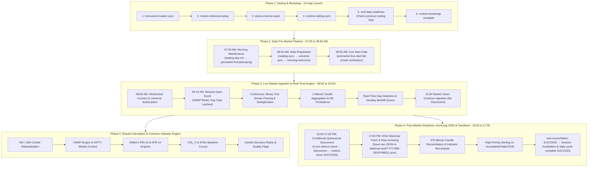
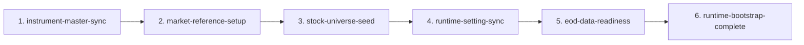
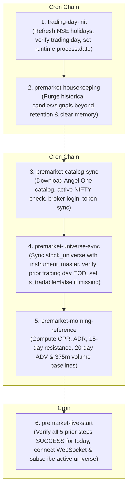
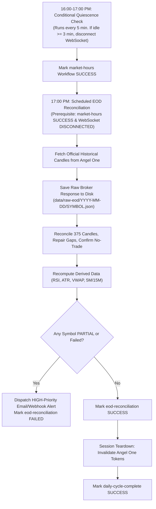

# Market Scanner Architecture & Workflow Guide (`project_workflow.md`)

This document is the authoritative developer, tester, and architecture guide for the Mithron Market Scanner Version 1. It tracks the complete, chronological end-to-end application lifecycle from bootstrapping to live streaming, calculations, post-market feed quiescence, raw broker disk archiving, 375-minute EOD reconciliation, high-priority alerting, and daily session teardown.

### Version Scope Boundary
- **Version 1 (Current Core Data & Workflow System - Phases 1 to 5):**
  - **Phase 1:** Application Bootstrapping & Startup Readiness
  - **Phase 2:** Daily Pre-Market Pipeline (07:00 AM Maintenance, 08:00 AM Data Preparation, 08:55 AM Live Start Gate)
  - **Phase 3:** Live Market Ingestion & Intraday Gap Repair (08:55 AM to Post-Market Quiescence)
  - **Phase 4:** Shared Calculation & Indicator Engine (VWAP, Wilder's RSI-14, ATR-14, VOL_X, Baselines, Candle Structure)
  - **Phase 5:** Post-Market Feed Shutdown, Raw Broker Disk Archiving, 375-Minute EOD Reconciliation, High-Priority Alerting & Session Teardown
- **Version 2 (Planned Next Release):**
  - Real-Time Strategy Execution Engine (VWAP Pullback, FCHB, ORB), Monotone Market State Scanning, Signal Audit Trail, and Web User Interface.

### Status Legend
- `[IMPLEMENTED + TESTED]`: Complete, verified in code, database, and comprehensive test suite (314 tests passing).

---

## Complete End-to-End Application Lifecycle Architecture (Version 1)

---

## Phase 1: Application Bootstrapping & Startup Readiness `[IMPLEMENTED + TESTED]`

**Purpose:** Orchestrated by `RuntimeBootstrapService`, executes a fail-closed 6-stage sequence upon initial application launch. Startup records in `workflow_status` have `process_date = NULL`.

### Stage Details
1. **`instrument-master-sync`:** Downloads Angel One instrument catalog, populates `instrument_master`, verifies `NIFTY/NSE` exists.
2. **`market-reference-setup`:** Ensures `NIFTY/NSE` is configured as an active `INDEX` in `instrument_master`.
3. **`stock-universe-seed`:** Reads selected symbols from CSV, resolves each against `instrument_master` as the single source of truth, and seeds `stock_universe` (`is_active = true`, `is_tradable = false`). Sets `active_from`:
   - If bootstrap runs **before 07:00 AM**: `active_from = today's date`.
   - If bootstrap runs **at or after 07:00 AM**: `active_from = tomorrow's date` (next trading day).
4. **`runtime-setting-sync`:** Verifies and auto-heals 16 required configuration parameters in `runtime_setting`.
5. **`eod-data-readiness`:** Verifies verified EOD data exists for the **previous official trading day** (`tradingCalendar.previousTradingDay(today)`). On fresh/empty databases, seeds initial baseline `EodDataEntry` records (`status = COMPLETE`, source = `INITIAL_BASELINE`).
6. **`runtime-bootstrap-complete`:** Performs a read-only token readiness check verifying non-blank broker tokens exist for all active stocks and `NIFTY`.

**Key Tables:** `workflow_status`, `instrument_master`, `stock_universe`, `runtime_setting`, `eod_data_entry`.

---

## Phase 2: Daily Pre-Market Pipeline `[IMPLEMENTED + TESTED]`

**Purpose:** Automated morning pipeline tracked in `workflow_status` (`workflow_group = "pre-market"`, `process_date = YYYY-MM-DD`). Orchestrated by `PreMarketWorkflowService` and scheduled via dynamic database triggers in `MarketScheduler`.

### Stage Details
1. **07:00 AM Morning Maintenance:**
   - **`trading-day-init`:** Queries `TradingCalendar` (`holiday_calendar` DB is single source of truth). If holiday/weekend, stops cleanly. If trading day, sets `runtime.process.date = today` and marks `SUCCESS`.
   - **`premarket-housekeeping`:** Purges data older than retention settings and clears memory caches.
2. **08:00 AM Pre-Market Data Preparation:**
   - **`premarket-catalog-sync`:** Downloads Angel One catalog, authenticates broker session early, syncs tokens with exponential backoff.
   - **`premarket-universe-sync`:** Reconciles active universe. Checks `eod_data_entry` for the **previous official trading day** (`tradingCalendar.previousTradingDay(today)`); if missing/incomplete for any symbol, demotes `is_tradable = false` while keeping `is_active = true` (streaming continues, trading blocked).
   - **`premarket-morning-reference`:** Authoritative computation of CPR, ADR, 15-day resistance, 20-day ADV, and 375m volume baseline curves into `DailyStockContext`.
3. **08:55 AM Live Start Gate:**
   - **`premarket-live-start`:** Strictly verifies all 5 prior daily steps are `SUCCESS` for today's date before connecting the WebSocket and starting the `market-hours` stage.

---

## Phase 3: Live Market Ingestion & Intraday Gap Repair `[IMPLEMENTED + TESTED]`

**Purpose:** Connects to Angel One SmartStream WebSocket, ingests real-time binary ticks, constructs canonical 1-minute candles, tracks feed health, and triggers live gap repair.

### Workflow & Ingestion Rules
1. **08:55 AM - Pre-Open Feed Connect:**
   - Connects to Angel One SmartStream WebSocket via `AngelOneWebSocketService`.
   - Subscribes to all active universe equities (`is_active = true`) and `NIFTY`.
   - Marks `market-hours` workflow stage as `RUNNING` for today.
2. **09:15 AM - Market Open Event:**
   - Daily VWAP resets strictly to 0 at 09:15:00.
   - Day Type latched at 09:15 based on NIFTY open vs previous close (`GAP_UP` > +0.75%, `GAP_DOWN` < -0.75%, `NORMAL`).
3. **Continuous Binary Tick Processing:**
   - `AngelOneTickParserService` decodes high-throughput binary tick packets (LTP, Volume, Open Interest, Bid/Ask).
   - Tick deduplication: Drops duplicate ticks with identical timestamps and cumulative volume.
4. **1-Minute Candle Construction & DB Persistence:**
   - `LiveMarketCandleService` accumulates ticks into 1M bars ($xx:xx:00 \dots xx:xx:59$).
   - On minute rollover, finalizes candle, persists to `market_candles`, and updates `market_minute_snapshot`.
5. **Real-Time Intraday Gap Detection & Repair:**
   - Missing minute detected $\rightarrow$ fires `IntradayGapDetectedEvent` $\rightarrow$ `IntradayCandleBackfillService` fetches missing 1M candles from Angel One REST API asynchronously without stalling live streaming.
6. **15:30 Market Close - Extended Ingestion Policy:**
   - No immediate unsubscription or disconnection at 15:30. Ingestion continues until at least 16:00 to capture post-market settlement ticks and closing adjustments.

---

## Phase 4: Shared Calculation & Common Indicator Engine `[IMPLEMENTED + TESTED]`

**Purpose:** Shared facts are calculated once and stored on canonical candle models to prevent calculation drift. Every calculation independently enforces strict prerequisite gating (Fail-Closed) and runs in complete isolation per symbol.

### Calculation Specifications & Validation Standards

#### 1. RSI-14 (Wilder's Smoothing)
- **Stored on:** `market_candles.rsi_14` (1M, 5M, 15M).
- **Prerequisite Gate:** Requires $\ge 42$ consecutive clean 1M candles of today. If $< 42 \to$ returns `null` (never `0.0`).
- **Seeding:** Simple average for first 14 candles (`avg_gain = sum(gains)/14`, `avg_loss = sum(losses)/14`).
- **Smoothing:** Wilder's smoothing for subsequent candles:
  $$\text{avg\_gain} = \frac{\text{prev\_avg\_gain} \times 13 + \text{current\_gain}}{14}, \quad \text{avg\_loss} = \frac{\text{prev\_avg\_loss} \times 13 + \text{current\_loss}}{14}$$
- **Tolerance:** Within 0.1 points vs TradingView RSI(14).

#### 2. ATR-14 (Wilder's Smoothing)
- **Stored on:** `market_candles.atr_14` (1M, 5M, 15M).
- **Prerequisite Gate:** Requires $\ge 14$ consecutive clean 1M candles of today **AND** authoritative `prevDayClose` from `stock_prices`. If $< 14$ or `prevDayClose == null` $\to$ returns `null`.
- **True Range:** $\text{TR} = \max(\text{high} - \text{low}, |\text{high} - \text{prev\_close}|, |\text{low} - \text{prev\_close}|)$.
- **Smoothing:** First 14 TR values simple average, then Wilder's smoothing.
- **Tolerance:** Within Rs. 0.05 vs TradingView ATR(14).

#### 3. VWAP & Derived Metrics
- **Stored on:** `market_candles.vwap` (Calculated on 1M, carried forward to 5M/15M).
- **Prerequisite Gate:** Requires $\ge 1$ candle today with volume $> 0$.
- **Formula:** $\text{TP} = (\text{high} + \text{low} + \text{close}) / 3$, $\text{VWAP} = \sum(\text{TP} \times \text{volume}) / \sum(\text{volume})$.
- **Reset:** Resets strictly at 09:15 AM every trading day.

#### 4. Volume Baselines & Runtime VOL_X
- **Active-From Trading Days Gate:** Evaluates `TradingCalendar.tradingDaysBetween(active_from, today)`. If completed trading days $< 20 \to$ ADV-20 baseline and $\text{VOL\_X}$ return `null` (Fail-Closed).
- **Runtime VOL_X:** $\text{VOL\_X} = \frac{\text{currentCumulativeVolume}}{\text{baselineCumulativeVolume}(\text{currentSessionMinute})}$.

#### 5. Candle Structure & Quality Flags
- **Zero-Range Guard:** If `high - low <= 0` or `low <= 0`, all ratios are `null`, `strongBullish = false`, `strongBearish = false`.
- **Strong Bullish:** `direction == BULLISH && bodyRatio >= 0.60 && upperWickRatio <= 0.25 && rangePct >= 0.15%`.
- **Strong Bearish:** `direction == BEARISH && bodyRatio >= 0.60 && lowerWickRatio <= 0.25 && rangePct >= 0.15%`.

---

## Phase 5: Post-Market Shutdown, Archiving, EOD Reconciliation & Teardown `[IMPLEMENTED + TESTED]`

**Purpose:** Orchestrates post-market feed quiescence shutdown, permanent raw broker API disk archiving, 375-minute candle reconciliation, derived indicator recomputation, high-priority alerting on data omissions, and clean daily session teardown.

### Stage Details
1. **16:00–17:00 PM - Quiescence Disconnect (`scheduledConditionalFlushAndDisconnect`):**
   - Scheduled via cron `0 */5 16-17 * * MON-FRI`.
   - Never disconnects before 16:00.
   - Evaluates inactivity: if `Duration.between(lastMessageReceivedAt, now).toMinutes() >= 3` (or if no timestamp available):
     - Flushes open candles and disconnects SmartStream WebSocket.
     - Unsubscribes active universe tokens and disables auto-reconnect.
     - Marks `market-hours` workflow stage as `SUCCESS`.
2. **17:00 PM - EOD Historical Fetch & Raw Archiving (`EodReconciliationService`):**
   - Scheduled via cron `0 0 17 * * MON-FRI`.
   - Verifies prerequisite: `market-hours` stage is `SUCCESS` and WebSocket is `DISCONNECTED`.
   - For every active symbol and `NIFTY`:
     - Calls Angel One REST API `fetchHistoricalOneMinuteCandles`.
     - Archives the raw response directly to disk: `<runtime.eod.raw-archive-dir>/<YYYY-MM-DD>/<SYMBOL>.json`.
3. **375-Minute Candle Matching & Derived Recomputation:**
   - Matches local 1M candles against provider candles for all 375 market minutes (09:15 to 15:29).
   - Inserts/repairs missing or mismatched candles in `market_candles` with `quality_status = REPAIRED`.
   - Recomputes derived indicators (`RSI-14`, `ATR-14`, `VWAP`, `5M`, `15M` candles) from the start of the day to ensure full analytical consistency.
   - Updates `eod_data_entry` and `DailyDataStatusService` completeness status.
4. **High-Priority Incomplete Data Alerting:**
   - If any symbol has `status != COMPLETE` or unresolved minutes $> 0$, immediately dispatches a **HIGH-priority email and webhook alert** via `RuntimeAlertService`.
   - Marks `eod-reconciliation` workflow stage as `FAILED` (fail-closed).
5. **Session Teardown & Lifecycle Finalization:**
   - If all symbols reconcile cleanly, marks `eod-reconciliation` as `SUCCESS`.
   - Executes session teardown: invalidates active Angel One broker session tokens (`angelOneSessionService.clearCachedSession()`).
   - Marks `daily-cycle-complete` workflow stage (group `session`) as `SUCCESS`.

---

## Core Database Tables Map

| Table Name | Primary Role | Key Columns |
|---|---|---|
| `workflow_status` | Workflow tracking & fail-closed dependency gates | `workflow_name`, `workflow_group`, `process_date`, `status`, `depends_on_workflow_id`, `is_active` |
| `instrument_master` | Canonical broker instrument catalog | `symbol`, `token`, `instrument_type`, `segment`, `is_active` |
| `stock_universe` | Curated 50-stock trading universe | `symbol`, `is_active`, `is_tradable`, `active_from`, `source` |
| `runtime_setting` | Dynamic operational parameters & crons | `name`, `value`, `value_type`, `is_active`, `updated_at` |
| `holiday_calendar` | Official exchange trading calendar | `holiday_date`, `description`, `is_trading_day` |
| `eod_data_entry` | EOD data completeness tracking | `symbol`, `trading_date`, `status`, `minute_count`, `matched_candles`, `repaired_candles` |
| `stock_prices` | Authoritative daily OHLCV prices | `symbol`, `trade_date`, `open`, `high`, `low`, `close`, `volume`, `vwap` |
| `market_candles` | 1M, 5M, 15M candles & indicators | `symbol`, `timeframe`, `candle_time`, `vwap`, `rsi_14`, `atr_14`, `quality_status` |
| `volume_daily_baseline` | Rolling 20-day ADV baselines | `symbol`, `avg_daily_volume_20`, `as_of_date` |
| `volume_time_window_baseline` | 375 session-minute baseline curves | `symbol`, `session_minute`, `cumulative_volume_mean` |
| `live_feed_state` | WebSocket connection & feed health | `connection_state`, `last_tick_time`, `subscribed_count` |
| `runtime_alert_state` | Runtime alerting audit log & status | `alert_key`, `severity`, `status`, `message`, `details` |

---

## Execution Summary (Version 1 Complete)

- [x] **Phase 1: Startup Pipeline Verification** `[COMPLETED + TESTED]`
- [x] **Phase 2: Daily Pre-Market Workflow Verification** `[COMPLETED + TESTED]`
- [x] **Phase 3: Live Market Ingestion & Feed Health Deep-Dive** `[COMPLETED + TESTED]`
- [x] **Phase 4: Shared Calculation & Common Engine Audit** `[COMPLETED + TESTED]`
- [x] **Phase 5: Post-Market Shutdown, Archiving, EOD Reconciliation & Teardown** `[COMPLETED + TESTED]`
