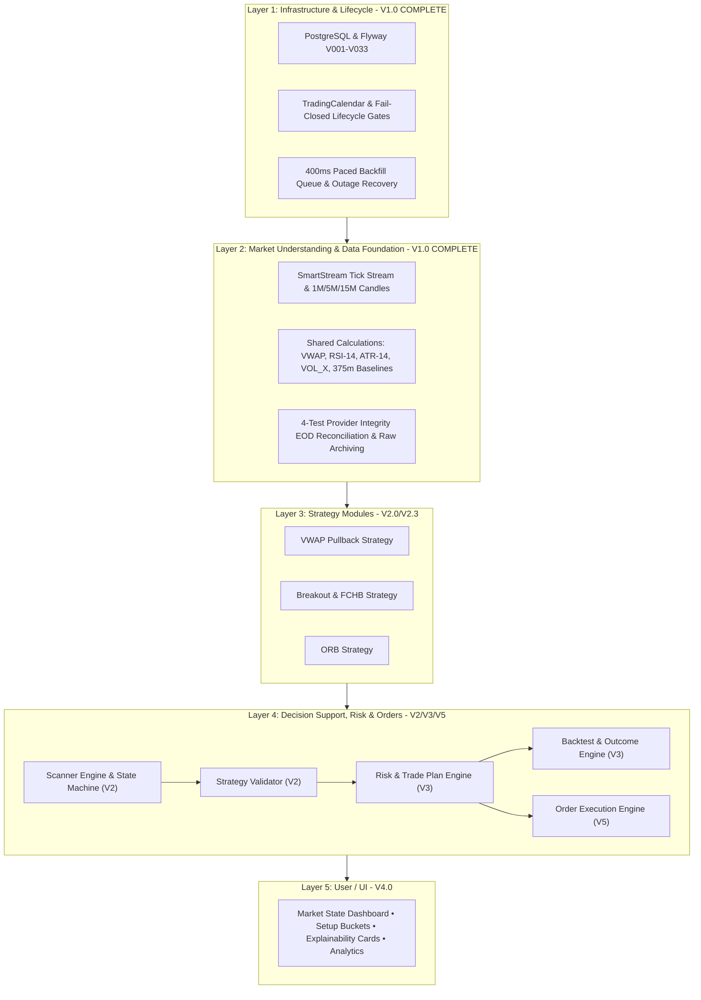
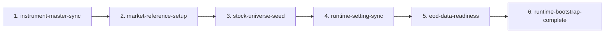
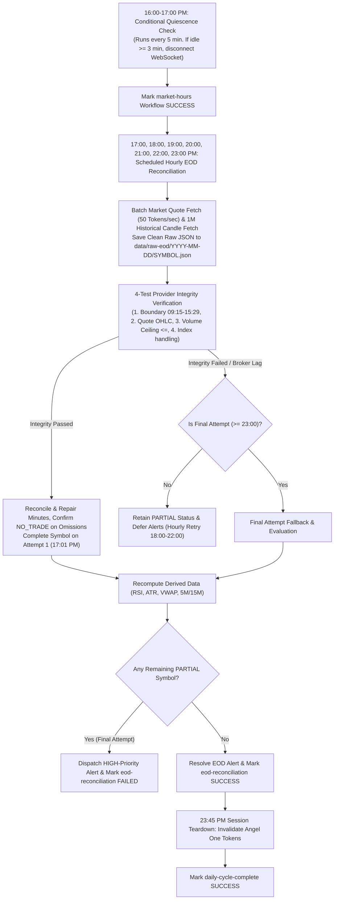

# Market Scanner Architecture & Workflow Guide (`project_workflow.md`)

This document is the authoritative developer, tester, and architecture guide for Mithron. It tracks the complete, chronological end-to-end application lifecycle from data foundation to strategy evaluation, risk-integrated historical backtesting, interactive trader UI, real-time order execution, and small-capital live trading.

---

### Master Version Scope Boundaries

- **Version 1.0 (Data & Market Lifecycle Foundation - COMPLETE ✅):**
  - **Phase 1:** Application Bootstrapping & Startup Readiness (6 fail-closed stages).
  - **Phase 2:** Daily Pre-Market Pipeline (07:00 AM Maintenance, 08:00 AM Data Preparation, 08:55 AM Live Start Gate).
  - **Phase 3:** Live Market Ingestion & Intraday Gap Repair (08:55 AM to Post-Market Quiescence, 400ms Paced Queue Worker).
  - **Phase 4:** Shared Calculation & Common Indicator Engine (VWAP, Wilder's RSI-14, ATR-14, VOL_X, Baselines, Candle Structure).
  - **Phase 5:** Post-Market Feed Shutdown, Raw Broker Disk Archiving, 4-Test Provider Integrity EOD Reconciliation, Alerting & Session Teardown.
  - **Runtime Developer Tools:** Swagger OpenAPI Inspector, Authenticated SmartAPI Proxy (`/broker/smartapi/proxy`), On-Demand EOD Reconciliation.
  - **Immediate Post-V1 Action:** Expand Universe to Nifty 500 to start accumulating 30+ days of clean 1M candles and baselines.

- **Version 2.0 (Strategy Intelligence & Real-Time Signals - NEXT MILESTONE):**
  - **V2.0:** Strategy Foundation & Design Freeze (Interfaces, Signal Models, Validator boundary).
  - **V2.1:** Market State Scanner (`TRENDING_UP`, `TRENDING_DOWN`, `RANGE`, `BREAKOUT_ENV`).
  - **V2.2:** Strategy Framework & First Strategy (VWAP Pullback end-to-end).
  - **V2.3:** Additional Core Strategies (FCHB — First Candle High Breakout, ORB — Opening Range Breakout).
  - **V2.4:** Strategy Validator (Verifies market state, data quality, trading window, duplicate checks, risk criteria).
  - **V2.5:** Signal Audit Trail (Explainability breakdown for approved & rejected setups).

- **Version 3.0 (Risk Engine & Historical Backtesting Laboratory):**
  - **Risk & Trade-Plan Engine:**
    - Structural Stop Loss & Invalidation Level.
    - Risk Distance (%) & Extension Guards (Max allowed risk per trade).
    - Position Sizing & Reward-to-Risk (R:R) targets.
    - Max Daily Loss hard cap & Trailing Stop rules.
  - **Historical Backtest Engine:**
    - Deterministic point-in-time replay using the **exact same strategy + risk code** across accumulated Nifty 500 dataset.
    - Evaluates complete trades (Entry, Invalidation, Stop, Target, Exit).
    - Performance Metrics: Win/Loss rate, Profit Factor, Max Drawdown, MFE/MAE, Expectancy.

- **Version 4.0 (Professional Web UI & Trader Dashboard):**
  - Live Market State & Nifty 500 Universe Overview.
  - Strategy Setup Buckets & Live Signal Cards with "Why is this stock here?" explainability.
  - Interactive Backtest Explorer & Strategy Analytics Charts.
  - Trade Plan Visualizer (Entry Zone, Stop, Target, Risk %).
  - Stock Search & History Timeline.

- **Version 5.0 (Trading Engine & Order Execution - SmartAPI):**
  - SmartAPI Order Service: `placeOrder`, `modifyOrder`, `cancelOrder`.
  - Live synchronization: Order Book, Trade Book, and Position Book.
  - Live execution integration with Risk Engine (Hard Daily Loss cutoff, Max Exposure, Kill Switch).
  - Order Lifecycle Audit Trail (`PROPOSED` $\to$ `SUBMITTED` $\to$ `FILLED` $\to$ `CLOSED`).

- **Version 6.0 (Small-Capital Live Trading & Paper/Live Toggle):**
  - Paper Mode vs Live Mode toggle.
  - Live execution with small real capital on proven strategies.
  - Production vs Backtest validation.

### Status Legend
- `[IMPLEMENTED + TESTED]`: Complete, verified in code, database, and test suite (314 unit tests passing).
- `[PLANNED]`: Architectural design finalized, scheduled for upcoming version release.

---

## The Strategy Promotion Pipeline

A strategy never jumps directly from an idea into real-money trading:

```text
Strategy Development (V2.0)
        ↓
Historical Backtest with Risk Engine (V3.0)
        ↓
Visual Inspection & Dashboard Analysis (V4.0)
        ↓
Trading Engine Integration & Order Simulation (V5.0)
        ↓
Small-Capital Live Trading (V6.0)
```

---

## 5-Layer System Architecture


```mermaid
flowchart TD
    subgraph Layer5 [Layer 5: User / UI - V4.0]
        U1["Market State Dashboard • Setup Buckets • Explainability Cards • Analytics"]
    end

    subgraph Layer4 [Layer 4: Decision Support, Risk & Orders - V2/V3/V5]
        D1["Scanner Engine & State Machine (V2)"] --> D2["Strategy Validator (V2)"]
        D2 --> D3["Risk & Trade Plan Engine (V3)"]
        D3 --> D4["Backtest & Outcome Engine (V3)"]
        D3 --> D5["Order Execution Engine (V5)"]
    end

    subgraph Layer3 [Layer 3: Strategy Modules - V2.0/V2.3]
        S1["VWAP Pullback Strategy"]
        S2["Breakout & FCHB Strategy"]
        S3["ORB Strategy"]
    end

    subgraph Layer2 [Layer 2: Market Understanding & Data Foundation - V1.0 COMPLETE]
        M1["SmartStream Tick Stream & 1M/5M/15M Candles"]
        M2["Shared Calculations: VWAP, RSI-14, ATR-14, VOL_X, 375m Baselines"]
        M3["4-Test Provider Integrity EOD Reconciliation & Raw Archiving"]
    end

    subgraph Layer1 [Layer 1: Infrastructure & Lifecycle - V1.0 COMPLETE]
        I1["PostgreSQL & Flyway V001-V033"]
        I2["TradingCalendar & Fail-Closed Lifecycle Gates"]
        I3["400ms Paced Backfill Queue & Outage Recovery"]
    end

    Layer1 --> Layer2
    Layer2 --> Layer3
    Layer3 --> Layer4
    Layer4 --> Layer5
```

---

## Phase 1: Application Bootstrapping & Startup Readiness `[IMPLEMENTED + TESTED]`

**Purpose:** Orchestrated by `RuntimeBootstrapService`, executes a fail-closed 6-stage sequence upon initial application launch. Startup records in `workflow_status` have `process_date = NULL`.


```mermaid
flowchart LR
    A["1. instrument-master-sync"] --> B["2. market-reference-setup"]
    B --> C["3. stock-universe-seed"]
    C --> D["4. runtime-setting-sync"]
    D --> E["5. eod-data-readiness"]
    E --> F["6. runtime-bootstrap-complete"]
```

### Stage Details
1. **`instrument-master-sync`:** Downloads Angel One instrument catalog, populates `instrument_master`, verifies `NIFTY/NSE` exists.
2. **`market-reference-setup`:** Ensures `NIFTY/NSE` is configured as an active `INDEX` in `instrument_master`.
3. **`stock-universe-seed`:** Reads selected symbols from CSV, resolves each against `instrument_master` as the single source of truth, and seeds `stock_universe` (`is_active = true`, `is_tradable = false`).
4. **`runtime-setting-sync`:** Verifies and auto-heals 16 required configuration parameters in `runtime_setting`.
5. **`eod-data-readiness`:** Verifies verified EOD data exists for the **previous official trading day**. On fresh databases, seeds initial baseline `EodDataEntry` records.
6. **`runtime-bootstrap-complete`:** Performs a read-only token readiness check verifying non-blank broker tokens exist for all active stocks and `NIFTY`.

---

## Phase 2: Daily Pre-Market Pipeline `[IMPLEMENTED + TESTED]`

**Purpose:** Automated morning pipeline tracked in `workflow_status` (`workflow_group = "pre-market"`, `process_date = YYYY-MM-DD`). Orchestrated by `PreMarketWorkflowService`.

### Stage Details
1. **07:00 AM Morning Maintenance:**
   - **`trading-day-init`:** Queries `TradingCalendar` (`holiday_calendar` DB is single source of truth). If holiday/weekend, stops cleanly. If trading day, sets `runtime.process.date = today` and marks `SUCCESS`.
   - **`premarket-housekeeping`:** Purges data older than retention settings and clears memory caches.
2. **08:00 AM Pre-Market Data Preparation:**
   - **`premarket-catalog-sync`:** Downloads master catalog (143k scrips), maps 2,747 NSE Cash instruments & NIFTY (`99926000`), authenticates broker session early, and verifies broker tokens directly from DB.
   - **`premarket-universe-sync`:** Reconciles active universe. Checks `eod_data_entry` for the previous trading day; if missing/incomplete for any symbol, demotes `is_tradable = false` while keeping `is_active = true`.
   - **`premarket-morning-reference`:** Authoritative computation of CPR, ADR, 15-day resistance, 20-day ADV, and 375m volume baseline curves for previous trading day into `DailyStockContext`.
3. **08:55 AM Live Start Gate:**
   - **`premarket-live-start`:** Strictly verifies all 5 prior daily steps are `SUCCESS` for today's date before connecting the WebSocket and starting the `market-hours` stage.

---

## Phase 3: Live Market Ingestion & Intraday Gap Repair `[IMPLEMENTED + TESTED]`

**Purpose:** Connects to Angel One SmartStream WebSocket, ingests real-time binary ticks, constructs canonical 1-minute candles, tracks feed health, and triggers live gap repair.

### Workflow & Ingestion Rules
1. **08:55 AM - Pre-Open Feed Connect:** Connects WebSocket and subscribes to active universe equities and `NIFTY`.
2. **09:15 AM - Market Open Event:** VWAP resets strictly to 0. Day Type latched at 09:15 (`GAP_UP` > +0.75%, `GAP_DOWN` < -0.75%, `NORMAL`).
3. **Continuous Binary Tick Processing:** `AngelOneTickParserService` decodes high-throughput packets; deduplicates duplicate ticks.
4. **1-Minute Candle Construction & DB Persistence:** `LiveMarketCandleService` accumulates ticks into 1M bars ($xx:xx:00 \dots xx:xx:59$), persists to `market_candles`, and updates `market_minute_snapshot`.
5. **Real-Time Gap Detection & Continuous Queue Worker Backfill:** Missing minute detected $\rightarrow$ enqueues job into `BackfillQueueService`. The background daemon worker continuously drains jobs at a paced rate of **400ms (2.5 RPS / 150 RPM)**, intercepting `AB1021` in-memory, confirming un-traded minutes as `NO_TRADE_CONFIRMED` on Attempt 1, and recomputing indicators in **~20.4 seconds flat** for all 51 symbols.
6. **15:30 Market Close Policy:** Ingestion continues until post-16:00 to capture post-market settlement ticks.

---

## Phase 4: Shared Calculation & Common Indicator Engine `[IMPLEMENTED + TESTED]`

**Purpose:** Shared facts are calculated once and stored on canonical candle models to prevent calculation drift.

### Validation Standards:
1. **RSI-14 (Wilder's Smoothing):** Requires $\ge 42$ consecutive clean 1M candles of today. Stored on 1M, 5M, 15M. Within 0.1 points vs TradingView.
2. **ATR-14 (Wilder's Smoothing):** Requires $\ge 14$ consecutive clean 1M candles of today + authoritative `prevDayClose`. Within Rs. 0.05 vs TradingView.
3. **VWAP & Derived Metrics:** Cumulative $(\text{TP} \times \text{volume}) / \sum(\text{volume})$. Resets strictly at 09:15 AM. Evaluates `niftyAboveVwap`, `niftyVwapDirection`, and `vwapProximityPct`.
4. **Volume Baselines & Runtime VOL_X:** 20-day ADV and 375 session-minute baseline curves. Requires $\ge 20$ completed trading days.
5. **Candle Structure & Quality Flags:** Zero-range guard, body ratio, upper/lower wick ratios, range percentage, and strong bullish/bearish classification.

---

## Phase 5: Post-Market Shutdown, Archiving, EOD Reconciliation & Teardown `[IMPLEMENTED + TESTED]`

**Purpose:** Quiescence shutdown, raw REST archiving, 4-test provider integrity verification, 375-minute candle reconciliation, alert management, and daily session teardown.


```mermaid
flowchart TD
    A["16:00-17:00 PM: Conditional Quiescence Check<br/>(Runs every 5 min. If idle >= 3 min, disconnect WebSocket)"] --> B["Mark market-hours Workflow SUCCESS"]
    B --> C["17:00, 18:00, 19:00, 20:00, 21:00, 22:00, 23:00 PM: Scheduled Hourly EOD Reconciliation"]
    C --> D["Batch Market Quote Fetch (50 Tokens/sec) & 1M Historical Candle Fetch<br/>Save Clean Raw JSON to data/raw-eod/YYYY-MM-DD/SYMBOL.json"]
    D --> E["4-Test Provider Integrity Verification<br/>(1. Boundary 09:15-15:29, 2. Quote OHLC, 3. Volume Ceiling <=, 4. Index handling)"]
    E -- Integrity Passed --> F["Reconcile & Repair Minutes, Confirm NO_TRADE on Omissions<br/>Complete Symbol on Attempt 1 (17:01 PM)"]
    E -- Integrity Failed / Broker Lag --> G{"Is Final Attempt (>= 23:00)?"}
    G -- No --> H["Retain PARTIAL Status & Defer Alerts (Hourly Retry 18:00-22:00)"]
    G -- Yes --> I["Final Attempt Fallback & Evaluation"]
    F --> J["Recompute Derived Data (RSI, ATR, VWAP, 5M/15M)"]
    I --> J
    J --> K{"Any Remaining PARTIAL Symbol?"}
    K -- Yes (Final Attempt) --> L["Dispatch HIGH-Priority Alert & Mark eod-reconciliation FAILED"]
    K -- No --> M["Resolve EOD Alert & Mark eod-reconciliation SUCCESS"]
    M --> N["23:45 PM Session Teardown: Invalidate Angel One Tokens"]
    N --> O["Mark daily-cycle-complete SUCCESS"]
```

---

## Strategy & Decision Roadmap Ahead: Version 2.0 to Version 6+ `[PLANNED]`

### Version 2.0: Strategy Intelligence & Real-Time Signals
- **Market State Scanner:** Evaluates `TRENDING_UP`, `TRENDING_DOWN`, `RANGE`, `BREAKOUT_ENV`.
- **Strategy Framework:** `MarketContext`, `ScannerRule`, `RuleResult`, `ScannerEngine`.
- **Core Strategies:** VWAP Pullback, FCHB (First Candle High Breakout), ORB (Opening Range Breakout).
- **Strategy Validator:** Independent gate verifying market state, data quality, trading window, duplicate checks, and risk limits.
- **Signal Audit Trail:** Persists signals with `rule_version` and immutable JSON `parameter_snapshot`.

### Version 3.0: Risk Engine & Historical Backtesting Laboratory
- **Risk Engine:** Stop loss, invalidation level, risk distance (%), position sizing, R:R targets, max daily loss hard cap.
- **Historical Backtesting Engine:** Point-in-time replay using the **exact same strategy + risk code** across the accumulated Nifty 500 dataset.
- **Outcome Metrics:** Win/loss rate, profit factor, max drawdown, MFE/MAE, statistical expectancy.

### Version 4.0: Professional Web UI & Trader Dashboard
- Live market state and Nifty 500 universe overview.
- Strategy setup buckets with "Why is this stock here?" explainability.
- Interactive backtest explorer, analytics charts, and trade plan visualizer.

### Version 5.0: Trading Engine & Order Execution (SmartAPI)
- SmartAPI order integration (`placeOrder`, `modifyOrder`, `cancelOrder`).
- Live order book, trade book, and position tracking.
- Hard daily loss cutoff, max exposure limits, and emergency kill switch.

### Version 6.0: Small-Capital Live Trading & Paper/Live Toggle
- Paper Mode vs Live Mode toggle.
- Small real capital execution on proven strategies, verifying production against backtest.

---

## Runtime Admin & Developer Endpoints `[IMPLEMENTED + TESTED]`

| Endpoint | Method | Purpose |
|---|---|---|
| `/admin/runtime/broker/smartapi/proxy` | `POST` | Authenticated SmartAPI proxy inspector to call any broker endpoint with active session headers |
| `/admin/runtime/broker/warmup` | `POST` | Warm up or refresh broker session tokens |
| `/admin/runtime/broker/status` | `GET` | Inspect active session token validity and expiration state |
| `/admin/runtime/broker/clear` | `POST` | Clear cached session tokens |
| `/admin/runtime/broker/reconcile-startup` | `POST` | Manually run startup state reconciliation |
| `/admin/runtime/connect-and-subscribe` | `POST` | Manually connect WebSocket and subscribe active universe |
| `/admin/runtime/flush-and-disconnect` | `POST` | Manually flush live candles and disconnect WebSocket |
| `/admin/runtime/eod/reconcile` | `POST` | Trigger on-demand 375-minute EOD reconciliation for any trading date |
| `/admin/runtime/housekeeping/run` | `POST` | Run historical data housekeeping purge on demand |
| `/admin/runtime/alerts` | `GET` | List all runtime alerts and their current resolution status |

---

## Core Database Tables Map

| Table Name | Primary Role | Key Columns |
|---|---|---|
| `workflow_status` | Workflow tracking & fail-closed dependency gates | `name`, `workflow_group`, `process_date`, `status`, `depends_on_workflow_id`, `is_active` |
| `instrument_master` | Canonical broker instrument catalog | `symbol`, `token`, `instrument_type`, `segment`, `is_active` |
| `stock_universe` | Curated 50-stock trading universe | `symbol`, `is_active`, `is_tradable`, `active_from`, `source` |
| `runtime_setting` | Dynamic operational parameters & crons | `name`, `value`, `value_type`, `is_active`, `updated_at` |
| `holiday_calendar` | Official exchange trading calendar | `holiday_date`, `description`, `is_trading_day` |
| `eod_data_entry` | EOD data completeness tracking | `symbol`, `trading_date`, `status`, `minute_count`, `matched_candles`, `repaired_candles` |
| `stock_prices` | Authoritative daily OHLCV prices | `symbol`, `trade_date`, `open`, `high`, `low`, `close`, `volume`, `vwap` |
| `market_candles` | 1M, 5M, 15M candles & indicators | `symbol`, `timeframe`, `candle_time`, `vwap`, `rsi_14`, `atr_14`, `quality_status` |
| `volume_daily_baseline` | Rolling 20-day ADV baselines | `symbol`, `avg_daily_volume_20`, `as_of_date` |
| `volume_time_window_baseline` | 375 session-minute baseline curves | `symbol`, `session_minute`, `cumulative_volume_mean` |
| `live_feed_state` | WebSocket connection & feed health | `connection_state`, `last_tick_time`, `subscribed_count` |
| `runtime_alert_state` | Runtime alerting audit log & status | `alert_key`, `severity`, `status`, `message`, `details` |

---

## Execution Status Summary

- [x] **Phase 1: Startup Pipeline Verification** `[COMPLETED + TESTED]`
- [x] **Phase 2: Daily Pre-Market Workflow Verification** `[COMPLETED + TESTED]`
- [x] **Phase 3: Live Market Ingestion & Feed Health Deep-Dive** `[COMPLETED + TESTED]`
- [x] **Phase 4: Shared Calculation & Common Engine Audit** `[COMPLETED + TESTED]`
- [x] **Phase 5: Post-Market Shutdown, Archiving, EOD Reconciliation & Teardown** `[COMPLETED + TESTED]`
- [ ] **V2.0: Strategy Foundation & Design Freeze** `[PLANNED]`
- [ ] **V2.1: Market State Scanner** `[PLANNED]`
- [ ] **V2.2: First Strategy (VWAP Pullback)** `[PLANNED]`
- [ ] **V2.3: Core Strategies (FCHB & ORB)** `[PLANNED]`
- [ ] **V3.0: Risk Engine & Historical Backtesting Laboratory** `[PLANNED]`
- [ ] **V4.0: Professional Web UI & Trader Dashboard** `[PLANNED]`
- [ ] **V5.0: Trading Engine & Order Execution (SmartAPI)** `[PLANNED]`
- [ ] **V6.0: Small-Capital Live Trading & Paper/Live Toggle** `[PLANNED]`
